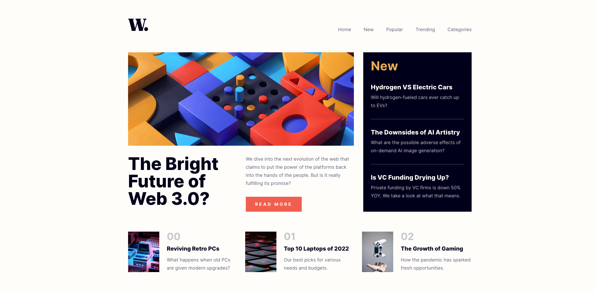
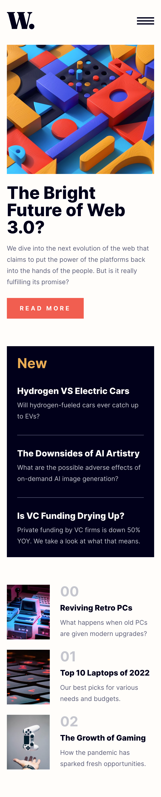

# Frontend Mentor - News homepage solution

This is a solution to the [News homepage challenge on Frontend Mentor](https://www.frontendmentor.io/challenges/news-homepage-H6SWTa1MFl). Frontend Mentor challenges help you improve your coding skills by building realistic projects.

## Table of contents

- [Overview](#overview)
  - [The challenge](#the-challenge)
  - [Screenshot](#screenshot)
  - [Links](#links)
- [My process](#my-process)
  - [Built with](#built-with)
  - [Useful resources](#useful-resources)
- [Author](#author)

## Overview

### The challenge

Users should be able to:

- View the optimal layout for the interface depending on their device's screen size
- See hover and focus states for all interactive elements on the page
- **Bonus**: Toggle the mobile menu (requires some JavaScript)

### Screenshot

### Links

- Solution URL: [Add solution URL here](https://github.com/bartektricks/news-homepage-fm)
- Live Site URL: [Add live site URL here](https://news-homepage-fm.vercel.app/)

## My process

Didn't dig into semantics and reusable components. My main goal was to see how Svelte works.

### Built with

- Vite
- Svelte
- TypeScript
- CSS custom properties
- Flexbox
- CSS Grid
- Mobile-first workflow
- SCSS

### Useful resources
- [Typing Components in Svelte](https://www.viget.com/articles/typing-components-in-svelte/)

## Author

- Frontend Mentor - [@bartektricks](https://www.frontendmentor.io/profile/yourusername)
- Twitter - [@bartektricks](https://www.twitter.com/yourusername)

